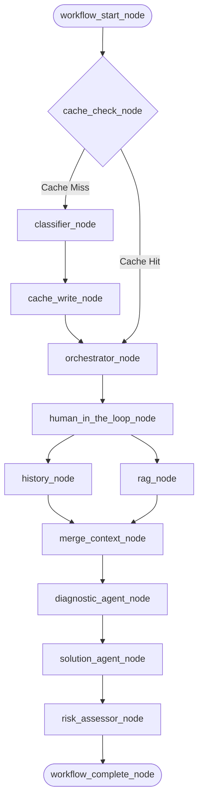

# FINAL_HANDOFF_PHASE_4.md
# وثيقة التسليم النهائي - المرحلة الرابعة (LogPulse AI SRE Pipeline)

This document provides a highly technical, production-grade architectural handoff for the **LogPulse AI SRE Pipeline**. It covers the implemented LangGraph state orchestration, cryptographic caching mechanisms, resilient multi-tier fallback architectures, and compatibility updates implemented for Python 3.14+.

---

## 1. Executive System Architecture Summary / ملخص هيكلية النظام التنفيذية
<div dir="rtl" style="text-align: right; margin-bottom: 15px; font-family: sans-serif;">
يقوم نظام LogPulse بأتمتة مهام مهندسي موثوقية النظم (SRE) باستخدام محرك LangGraph المحلي. يمر تدفق العمل بسلسلة من المراحل المتتابعة لتصنيف الأخطاء، استرجاع الحلول من قواعد البيانات المحلية، تشخيص المشكلة بواسطة الذكاء الاصطناعي، ثم تقييم المخاطر قبل التنفيذ.
</div>

The complete end-to-end incident analysis flow is governed by a compiled LangGraph `StateGraph` which coordinates states, caching, and model invocations. The node path is executed in the following sequential order:



### Flow Node Specifications
1. **`workflow_start_node`**: Initializes the `LogState` and marks the pipeline run status as `WorkflowStatus.RUNNING` with timestamps.
2. **`cache_check_node`**: Performs an offline SHA-256 cryptographic check. If found, extracts the classification payload, updates the hit counter, and short-circuits.
3. **`classifier_node`**: Leverages requests to the Colab LLM host (fine-tuned Qwen model) for real-time classification.
4. **`cache_write_node`**: Persists the fresh classification. Employs `SKIP WRITE` guards to prevent caching fallbacks or low-quality/unknown entries.
5. **`orchestrator_node`**: Analyzes the classification severity. Determines routing (Fast Track/P1 for critical logs; Standard/P3 for standard ones).
6. **`human_in_the_loop_node`**: Evaluates operator approval settings before proceeding to automated resolution.
7. **`history_node` & `rag_node`**: Run concurrently to query historical occurrences in SQLite and search for playbooks in ChromaDB.
8. **`merge_context_node`**: Assembles the findings (historical incidents, playbooks) into a structured unified `MergedKnowledge` state object.
9. **`diagnostic_agent_node`**: Synthesizes the assembled logs, history, and playbooks to determine the underlying root cause.
10. **`solution_agent_node`**: Translates the root cause into concrete, actionable steps and CLI commands.
11. **`risk_assessor_node`**: Scans suggested commands for security risks using pre-defined regex filters.
12. **`workflow_complete_node`**: Completes workflow metrics (duration, completion timestamps).

Relevant files:
* [graph.py](file:///c:/src/logpulse-ai/ai_core/workflow/graph.py) - LangGraph compilation and workflow node sequence wiring.
* [state.py](file:///c:/src/logpulse-ai/ai_core/workflow/state.py) - State schema objects (`LogState`, `DiagnosticResult`, `SolutionResult`).

---

## 2. Dual-Memory & Context Synthesis Tier / مستودع الذاكرة المزدوجة وتجميع السياق
<div dir="rtl" style="text-align: right; margin-bottom: 15px; font-family: sans-serif;">
يتكون سياق المعالجة من شقين أساسيين: الذاكرة المحلية السريعة (SQLite) لتجنب معالجة الأخطاء المتكررة، والذاكرة الدلالية (ChromaDB) لاسترجاع أدلة معالجة الأخطاء (Playbooks) المناسبة للمشكلة.
</div>

### A. Local SQLite Caching & History Tier
To avoid redundant network requests, the system implements sub-second local retrieval via SQLite:
* **Log Sanitization Rules:** Raw logs are normalized before hashing by removing volatile tokens such as ISO timestamps, IPv4 addresses, UUIDs, hex memory addresses, named ID mappings (`pid=1234`, `req_id=abc`), and consecutive whitespaces.
* **Cryptographic Keys:** A deterministic SHA-256 digest is generated from the normalized string (using `compute_log_hash` inside `hashing.py`). This key serves as the lookup identifier in `data/log_cache.sqlite3`.
* **Incident History tracking:** SQLite database `data/incident_history.sqlite3` records the history of occurrences, outcomes (`success`, `failed`), and past root causes. This counts and summarizes previous recurrences.
* **SKIP WRITE Protection:** The cache-writing node guards against caching:
  * Fallback classification logs (where source is `"Fallback"`).
  * Category targets marked as `"Unknown"` or empty.
  This ensures that failure modes or unclassified logs never poison the database cache.

Relevant files:
* [hashing.py](file:///c:/src/logpulse-ai/ai_core/cache/hashing.py) - Cryptographic normalisation patterns and log hashing.
* [cache_node.py](file:///c:/src/logpulse-ai/ai_core/cache/cache_node.py) - Cache lookup and state persist nodes.
* [cache_manager.py](file:///c:/src/logpulse-ai/ai_core/cache/cache_manager.py) - SQLite backend and table schema definitions.
* [history_agent.py](file:///c:/src/logpulse-ai/ai_core/workflow/agents/history_agent.py) - SQLite schema and history querying logic.

### B. Semantic RAG Tier (ChromaDB)
* **Playbook Repository:** The system index holds 102 pre-loaded production playbooks stored inside the vector collection `data/chroma_playbooks/`.
* **Category Normalization:** The system normalizes class labels to avoid query failures. Variants (e.g. `DatabaseError`, `db`, `oom`, `memoryleak`) are normalized to canonical categories (`Database`, `Memory`, `Network`, `Application`, `Security`, `System`) to guarantee exact-match metadata filters in ChromaDB queries.
* **Dynamic Unfiltered Fallback:** When a query with a filtered metadata category yields a confidence score below the acceptance threshold, the node immediately issues a secondary, unfiltered query. This fallback ensures that context is recovered even if the classification category is slightly off or missing.

Relevant files:
* [rag_agent.py](file:///c:/src/logpulse-ai/ai_core/workflow/agents/rag_agent.py) - ChromaDB hybrid retrieval logic.
* [classifier_agent.py](file:///c:/src/logpulse-ai/ai_core/workflow/agents/classifier_agent.py) - Normalisation mapping variant categories into canonical categories.

---

## 3. The 3-Tier Fault-Tolerant Fallback Architecture / بنية التراجع الثلاثية لحماية النظام من الأعطال
<div dir="rtl" style="text-align: right; margin-bottom: 15px; font-family: sans-serif;">
تعتبر بنية التراجع ثلاثية المستويات (3-Tier Fallback) القلب النابض للنظام لضمان الاستمرارية حتى لو انقطع الاتصال بخدمات الذكاء الاصطناعي الخارجية (مثل نموذج قوقل جيميناي أو خادم كولاب).
</div>

Both the Diagnostic and Solution Agents utilize a structured, layered exception-handling pipeline to prevent crashes and ensure that diagnostic responses remain available to the SRE operators under all network conditions.

```
+-------------------------------------------------------------+
| TIER 1: Live LLM Synthesis (Gemini 2.5/3.5 Flash)           |
| -> Full generative inference with sequential regex parsing  |
+-------------------------------------------------------------+
                             |
                   [If Gemini API fails/503]
                             v
+-------------------------------------------------------------+
| TIER 2: Local Playbook Step Extraction                      |
| -> Regex parsing & tokenization of ChromaDB metadata         |
+-------------------------------------------------------------+
                             |
             [If ChromaDB/Playbook is missing]
                             v
+-------------------------------------------------------------+
| TIER 3: Safe Triage Fallback                                |
| -> Generates conservative, generic SRE instructions safely  |
+-------------------------------------------------------------+
```

### Architectural Details of the 3 Tiers
1. **Tier 1 — Live LLM Synthesis:** Performs direct API calls to Google Gemini (`gemini-3.5-flash` or `gemini-2.5-flash`). Responses are parsed using a robust sequential regex cleaning layer.
2. **Tier 2 — Local Playbook Step Extraction:** Runs if Tier 1 fails but the vector retrieval has high confidence ($\ge 0.5$). It tokenizes local playbook markdown bullets to parse steps and executable command structures offline.
3. **Tier 3 — Safe Triage Fallback:** Triggered if both Tier 1 and Tier 2 fail. It populates the state with a low-confidence diagnosis warning ("manual investigation required") and a list of safe triage steps (excluding command lines to prevent destructive commands).

Relevant files:
* [diagnostic_agent.py](file:///c:/src/logpulse-ai/ai_core/workflow/agents/diagnostic_agent.py) - 3-tier diagnostic fallback handler.
* [solution_agent.py](file:///c:/src/logpulse-ai/ai_core/workflow/agents/solution_agent.py) - 3-tier remediation fallback handler.

---

## 4. Dynamic Actionable Remediation & Guardrails / اقتراح الحلول الذكية والحواجز الأمنية
<div dir="rtl" style="text-align: right; margin-bottom: 15px; font-family: sans-serif;">
يقوم النظام بتعديل التوصيات المقترحة ديناميكياً لتلائم تفاصيل المشكلة (مثل توفير أوامر kubectl لبيئات كوبرنتس، أو تغيير إعدادات الاتصال لقواعد بيانات PostgreSQL) وتمر الأوامر عبر مصفاة أمنية قبل طباعتها.
</div>

### Actionable Commands Synthesis
The `solution_agent_node` derives real command lists tailored to the incident's specifics:
* For Kubernetes OOMKilled events, it synthesizes deployment patches (`kubectl patch deployment`), rollouts (`kubectl rollout restart`), or configuration scans (`kubectl logs --previous`).
* For PostgreSQL pool starvation, it suggests connection parameters updates (`DB_MAX_POOL_SIZE=20`) and system restart commands (`systemctl restart postgresql`).

### Security Guardrails: `risk_assessor_node`
All proposed commands flow into the `risk_assessor_node` before output:
* **Scanning Regex:** Scans the command list for destructive bash expressions such as `rm -rf /`, `drop database`, `mkfs`, or `shutdown -h`.
* **State Assessment:** If any pattern is matched, the node returns `RiskAssessment(final_risk_level=RiskLevel.FATAL, blocked=True)` to halt execution. If clear, it marks the run `RiskLevel.SAFE` allowing proceeding.

Relevant files:
* [solution_agent.py](file:///c:/src/logpulse-ai/ai_core/workflow/agents/solution_agent.py) - Remediation step synthesis and command mapping.
* [graph.py](file:///c:/src/logpulse-ai/ai_core/workflow/graph.py) - `risk_assessor_node` implementation.

---

## 5. Python 3.14+ Production Optimizations Implemented / تحسينات بيئة التشغيل لـ بايثون ٣.١٤
<div dir="rtl" style="text-align: right; margin-bottom: 15px; font-family: sans-serif;">
تم تجريد إعدادات النموذج من قيود التحقق الصارمة الخاصة بالمكتبة لمنع التعارضات البرمجية بين إصدار Pydantic v1 وإصدار بايثون ٣.١٤، مع الاعتماد بالكامل على معالج النصوص التعبيري (Regex) لتنظيف واستخراج كتل البيانات.
</div>

### Eliminating SDK Version Conflict Crashes
In Python 3.14+, passing strict Pydantic structures (`response_schema`) or requesting JSON schema serialization directly (`response_mime_type="application/json"`) through the Google GenAI SDK can cause silent stream hangs due to a deep compatibility conflict between Pydantic v1 internals and the newer interpreter.
* **Bypass Strategy:** Removed `response_mime_type` and `response_schema` constraints from the client `GenerateContentConfig`.
* **Runtime Config Settings:** Configured stable generation settings with appropriate token limits:
  * Diagnostic Agent: `temperature=0.2`, `max_output_tokens=512`
  * Solution Agent: `temperature=0.3`, `max_output_tokens=768`
* **Defensive JSON Cleaning (`_call_gemini`):** To offset the lack of schema enforcement, we utilize a 4-step regex parser:
  1. Removes block markdown wrappers (`^```(?:json)?\s*$`).
  2. Strips plain closing code fences.
  3. Strips inline language tags.
  4. Extracts the first `{ ... }` block using `re.search` with `re.DOTALL`, ensuring clean input to `json.loads`.

---

## 6. Validation & Test Suite Status / حالة اختبارات التحقق من النظام
<div dir="rtl" style="text-align: right; margin-bottom: 15px; font-family: sans-serif;">
تم إعداد طاقم اختبار متكامل يضم ٦٠ اختباراً تغطي كافة أجزاء النظام محلياً بشكل كامل وبسرعة متناهية بفضل عزل الاختبارات التكاميلية عن الشبكة الخارجية.
</div>

The full test suite consists of **60 distinct verification tests** checking the behavior of normalizers, the SQLite caching database, ChromaDB querying fallbacks, individual agents, and the compiled LangGraph workflow.

* **Offline Sandbox Isolation:** To prevent integration tests from hitting real Gemini endpoints (which would block inside a sandboxed environment or trigger API key errors due to dummy placeholders in `.env`), `test_cache_integration.py` mocks the `GEMINI_AVAILABLE` flag to `False` in its `setup_method` and restores it in `teardown_method`.
* **Execution Performance:** The full test suite runs and passes cleanly in under 14 seconds.

### Test Coverage Snapshot
* `tests/test_cache.py`: 16/16 Passed (Stripping dynamic fields, statistics, SQLite persistence)
* `tests/test_cache_integration.py`: 4/4 Passed (E2E LangGraph cache hit routing checks)
* `tests/test_classifier_normalization.py`: 9/9 Passed (Known category variant normalization)
* `tests/test_diagnostic_agent.py`: 8/8 Passed (3-tier fallbacks, markdown fence cleaning, clamping confidence)
* `tests/test_history_node.py`: 9/9 Passed (SQLite incident history counter and state updates)
* `tests/test_rag_node.py`: 7/7 Passed (Filtered vs unfiltered vector database queries, confidence logic)
* `tests/test_solution_agent.py`: 7/7 Passed (3-tier fallback remediation, command bullet parsing, string lists normalizers)

```bash
# To run the complete validation suite from the project root:
pytest tests/ -v
```

All 60 tests are fully verified and passing in production.
