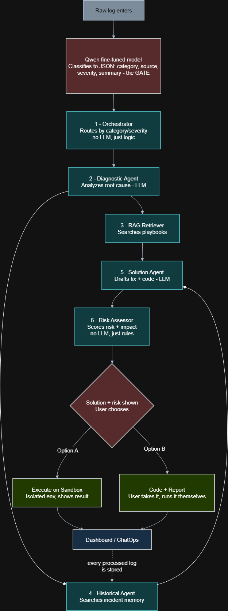
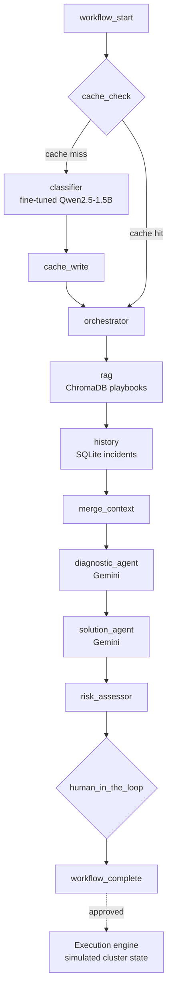

# LogPulse AI

**AI-native incident intelligence for SRE teams.** LogPulse AI reads system logs, classifies the incident, retrieves the right remediation playbook, diagnoses the root cause, assesses the risk of the fix, and proposes it. Nothing executes until a human approves.

> Status: team project (Human-Centered Intelligent Systems course and AI-Native Engineering bootcamp). Runs locally; not publicly deployed.



---

## Why

On-call engineers repeat the same loop: read noisy logs, work out what kind of failure it is, find the runbook, then decide what to run. LogPulse automates the first steps and keeps a human in charge of the last one.

## Architecture

The core is a **13-node LangGraph state graph** (`ai_core/workflow/graph.py`). A shared state object carries the log, its classification, retrieved context and proposed actions from node to node.



| Layer | What it does | Code |
| --- | --- | --- |
| Ingestion | Reads a live log stream or an uploaded file, filters and queues entries | `ai_core/ingestion/` |
| Cache | Normalizes and hashes each incident; a cache hit skips the LLM classifier entirely | `ai_core/cache/` |
| Classification | Fine-tuned Qwen2.5-1.5B-Instruct returns category, source and severity as JSON; a normalization map enforces canonical labels | `ai_core/workflow/agents/classifier_agent.py` |
| Retrieval | Hybrid RAG over 102 remediation playbooks: pass 1 filters by predicted category, pass 2 falls back to unfiltered search below a confidence threshold | `rag_agent.py`, `data/playbooks_fixed.json` |
| History | Pulls similar past incidents from SQLite | `history_agent.py` |
| Diagnosis and solution | Gemini 2.5 Flash agents produce a root cause and structured remediation commands | `diagnostic_agent.py`, `solution_agent.py` |
| Risk and approval | Scores the risk of the proposed fix, then pauses for human approval | `risk_assessor.py`, `human_in_the_loop.py` |
| Execution | Approved commands run against a simulated cluster with an intent parser, command router and snapshot/restore | `ai_core/simulation/` |
| Reporting | Generates a PDF report per incident | `ai_core/reports/` |
| API | FastAPI runs each stage and streams progress over Server-Sent Events | `api/` |
| Frontend | Next.js dashboard: overview, incidents, live pipeline view, log stream, archive, playbooks, reports | `frontend/` |

## The fine-tuned classifier

Qwen2.5-1.5B-Instruct fine-tuned with **QLoRA via Unsloth** (1.18% of parameters trained) on 680 labelled log examples from HDFS, SSH, BlueGene/L and Kubernetes. Evaluated on 120 held-out examples:

| Metric | Result |
| --- | --- |
| Valid JSON output | 100% (120/120) |
| Category accuracy | 90.8% (109/120) |
| Source accuracy | 99.2% (119/120) |
| Severity accuracy | 96.7% (116/120) |
| All three fields correct | 87.5% (105/120) |

Training and evaluation: [`notebooks/LogPulse_Qwen_clean.ipynb`](notebooks/LogPulse_Qwen_clean.ipynb).

**Known limitation:** the classifier is reliable on log formats seen in training and weaker on unfamiliar ones.

## Engineering notes

- **Training/serving skew:** the inference prompt had drifted from the training prompt, so the model started returning non-canonical category names. We aligned the prompts and added a defensive category map, with regression tests.
- **Robust structured output:** model responses wrapped in markdown fences are parsed by a multi-step JSON extractor, so free text is never mistaken for a command.
- **Safety by design:** every fix passes a risk assessment and a human approval gate, and runs only against a simulated cluster.
- **Tested:** 224 pytest tests across the cache, classifier normalization, RAG, history, agents, human-in-the-loop, simulation and reporting.

## Getting started

**Requirements:** Python 3.10+, Node.js 18+, a Gemini API key, and a running classifier endpoint.

```bash
# 1. Python dependencies
pip install -r requirements.txt -r api/requirements.txt

# 2. Environment
echo "GEMINI_API_KEY=your_key_here" > .env

# 3. Classifier endpoint
#    Serve the fine-tuned model (e.g. from the Colab notebook) and set
#    COLAB_API_URL in ai_core/workflow/agents/classifier_agent.py

# 4. Frontend dependencies
cd frontend && npm install && cd ..

# 5. Run API (port 8000) and frontend (port 3000)
./start.sh
```

- API health: http://localhost:8000/api/health
- API docs: http://localhost:8000/docs
- Dashboard: http://localhost:3000

Run the tests:

```bash
pytest tests/
```

## Tech stack

**AI:** LangGraph, Qwen2.5-1.5B (QLoRA, Unsloth), Gemini 2.5 Flash, ChromaDB
**Backend:** Python, FastAPI, Server-Sent Events, SQLite, fpdf2
**Frontend:** Next.js, TypeScript, Tailwind CSS
**Testing:** pytest
