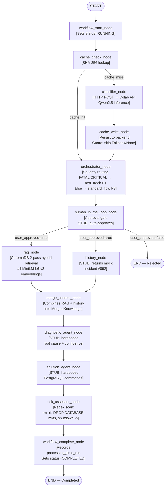

# LogPulse AI — Master Architectural Blueprint

> **Document Type:** Living Technical Reference · Complete & Standalone
> **Status:** Phase 2 Complete — Intelligent Cache Layer Integrated
> **Date:** 2026-05-27
> **Author:** CS-Abdulaziz
> **Scope:** 360-degree architectural review of the entire repository. This document supersedes all prior handoff documents and is the definitive single source of truth for Phase 3 development.

---

## Table of Contents

1. [Executive Summary & Value Proposition](#1-executive-summary--value-proposition)
2. [Full System Architecture — The Hybrid Model](#2-full-system-architecture--the-hybrid-model)
3. [Core Data Structures — State Management](#3-core-data-structures--state-management)
4. [The Complete LangGraph DAG — Node-by-Node Breakdown](#4-the-complete-langgraph-dag--node-by-node-breakdown)
5. [Deep Dive: The Intelligent Cache Layer](#5-deep-dive-the-intelligent-cache-layer)
6. [Deep Dive: The RAG Engine](#6-deep-dive-the-rag-engine)
7. [Deep Dive: The Cloud Inference Backend](#7-deep-dive-the-cloud-inference-backend)
8. [Complete Repository File Map](#8-complete-repository-file-map)
9. [Test Suite Architecture](#9-test-suite-architecture)
10. [Developer Setup & Operations Guide](#10-developer-setup--operations-guide)
11. [Phase 3 Roadmap — What's Next](#11-phase-3-roadmap--whats-next)

---

## 1. Executive Summary & Value Proposition

### 1.1 What Is LogPulse?

**LogPulse** is an AI-driven Site Reliability Engineering (SRE) automation pipeline. It ingests raw infrastructure log lines, classifies their severity and failure category using a fine-tuned large language model, retrieves relevant remediation playbooks from a vector knowledge base, and generates validated shell commands for resolving the incident — all in under five seconds for known incident patterns.

The system targets the most acute pain point in SRE operations: the gap between a FATAL log event firing and a human engineer producing a safe, actionable remediation plan.

### 1.2 The Problem

In modern distributed systems — Kubernetes clusters, microservice meshes, managed databases — a single production fault generates hundreds to thousands of log lines per minute across multiple replicas and infrastructure layers. During an on-call incident:

- Engineers must manually sift through log streams to locate the root event
- Runbook retrieval is slow and depends on institutional knowledge
- Writing safe remediation commands under pressure is error-prone
- The same incident type (e.g., PostgreSQL connection pool exhaustion) fires repeatedly, triggering manual triage each time

**The result:** Mean Time to Resolution (MTTR) of 15–60 minutes. Pages at 3 AM. Alert fatigue. Engineer burnout.

### 1.3 The LogPulse Solution

| Traditional SRE Workflow | LogPulse SRE Workflow |
|---|---|
| Engineer paged, reads raw log stream manually | Raw log line ingested → classified by AI in < 1 second |
| Searches Confluence runbooks under pressure | RAG engine retrieves top-matching playbook from 102-entry knowledge base |
| Engineer writes remediation commands from memory | Solution agent generates parameterized `kubectl`/`systemctl` commands |
| No command safety check before execution | Risk assessor regex-scans every command for destructive patterns |
| Same incident retriage if it recurs | Cache layer intercepts duplicates — zero additional LLM calls |
| MTTR: 15–60 minutes | Target MTTR: < 5 minutes with human approval gate |

### 1.4 The Human-in-the-Loop Philosophy

LogPulse is **not** a fully autonomous system. A deliberate **Human-in-the-Loop (HITL) approval gate** sits between AI-generated remediation and any execution. The system:

1. Classifies the incident and retrieves context autonomously
2. Generates a remediation plan with risk annotations
3. **Pauses and presents the plan to a human operator for approval**
4. Only after explicit approval would execution proceed

This philosophy is non-negotiable. The `WorkflowStatus.WAITING_FOR_APPROVAL` enum value is already codified in `state.py`. The current stub auto-approves for development purposes — production readiness requires a real approval channel (Phase 3 target).

---

## 2. Full System Architecture — The Hybrid Model

### 2.1 Architectural Overview

LogPulse is built on a **deliberately decoupled hybrid architecture** that separates orchestration logic (which runs locally, requires no GPU) from LLM inference (which runs on a cloud GPU). This decision drives every other architectural choice.

```
┌─────────────────────────────────────────────────────────────────────┐
│                        LOCAL MACHINE                                │
│                                                                     │
│  ┌──────────────────────────────────────────────────────────────┐   │
│  │              LangGraph DAG Orchestrator                      │   │
│  │                                                              │   │
│  │  ┌─────────────┐   ┌─────────────────┐   ┌───────────────┐  │   │
│  │  │ Cache Layer │   │ RAG Engine      │   │ Risk Assessor │  │   │
│  │  │ (hashing.py │   │ (ChromaDB       │   │ (regex scan)  │  │   │
│  │  │  + SQLite)  │   │  local store)   │   │               │  │   │
│  │  └─────────────┘   └─────────────────┘   └───────────────┘  │   │
│  │                                                              │   │
│  │  All nodes: lightweight Python · zero GPU requirement        │   │
│  └──────────────────────────────────────────────────────────────┘   │
│                                                                     │
└───────────────────────────┬─────────────────────────────────────────┘
                            │
                            │  HTTP POST /generate
                            │  {"prompt": "<raw_log>"}
                            │  [ONLY on cache miss — one call per unique incident pattern]
                            │
                            ▼
┌─────────────────────────────────────────────────────────────────────┐
│                    GOOGLE COLAB (T4 GPU — Free Tier)                │
│                                                                     │
│  FastAPI Server (port 8000) · uvicorn · background thread           │
│  └── Qwen2.5-1.5B-Instruct + LoRA adapter (4-bit quantized)        │
│      └── Returns: {"category", "source", "severity", "summary"}    │
│                                                                     │
│  Public access via: ngrok HTTPS tunnel (ephemeral URL)             │
│  Auth:  NGROK_TOKEN read from Colab Secrets                        │
│  Model: AbdulazizCS/logpulse-qwen-classifier on HuggingFace        │
└─────────────────────────────────────────────────────────────────────┘
```

### 2.2 Why This Architecture?

**Problem with running the LLM locally:**
- Qwen2.5-1.5B in 4-bit quantization requires ~3.3 GB VRAM minimum
- Local inference startup time adds 30–90 seconds per process launch
- Blocks local GPU resources during development
- Makes the pipeline unusable on CPU-only machines

**Solution — Decouple inference from orchestration:**
- The LangGraph DAG is pure Python; it can run, be tested, and be debugged on any laptop
- The Colab T4 session can be independently restarted, upgraded, or swapped with a production endpoint (GCP Vertex AI, AWS SageMaker, Azure ML) — **only one constant in `classifier_agent.py` changes**
- The cache layer further reduces dependency on Colab availability: once an incident pattern has been classified once, it never hits the network again

### 2.3 The ngrok Bridge

Google Colab does not expose a public IP address or open inbound ports. **pyngrok** solves this by creating an authenticated HTTPS tunnel from the Colab runtime to a public endpoint:

```python
# Inside notebooks/test_model_inference (1).ipynb
from pyngrok import ngrok

PORT = 8000
public_url = ngrok.connect(PORT)
print(f"Your API URL is: {public_url.public_url}/generate")
# Example: https://graced-regalia-unused.ngrok-free.app/generate
```

The uvicorn ASGI server runs on a background thread so the Colab cell continues executing:

```python
import threading, uvicorn

def run_app():
    uvicorn.run(app, host="0.0.0.0", port=PORT)

thread = threading.Thread(target=run_app, daemon=True)
thread.start()
```

**Critical operational note:** The ngrok URL is **ephemeral** — it changes every time the Colab runtime restarts. After each session restart, the new URL must be manually copied into `COLAB_API_URL` in `classifier_agent.py` before running the local pipeline.

**Security:** The ngrok auth token is never hardcoded. It is stored as a Colab Secret (`NGROK_TOKEN`) and read at runtime via `google.colab.userdata.get('NGROK_TOKEN')`.

---

## 3. Core Data Structures — State Management

### 3.1 Philosophy

All data that flows between LangGraph nodes lives in a single **`LogState`** Pydantic model defined in `ai_core/workflow/state.py`. Each node receives the complete, immutable state snapshot and returns a `Dict[str, Any]` containing only the keys it mutates. LangGraph merges these partial updates automatically into the next state snapshot. No node ever mutates state in place (with the minor exception of `workflow_start_node` and `workflow_complete_node`, which mutate `execution` fields — a pragmatic simplification acceptable for the current scale).

### 3.2 Enum Definitions

```python
class SeverityLevel(str, Enum):
    INFO     = "Info"
    WARNING  = "Warning"
    CRITICAL = "Critical"
    FATAL    = "Fatal"

class RiskLevel(str, Enum):
    SAFE   = "Safe"
    MEDIUM = "Medium"
    HIGH   = "High"
    FATAL  = "Fatal"

class WorkflowStatus(str, Enum):
    PENDING              = "Pending"
    RUNNING              = "Running"
    WAITING_FOR_APPROVAL = "WaitingForApproval"  # reserved for Phase 3 HITL
    COMPLETED            = "Completed"
    FAILED               = "Failed"
```

`SeverityLevel` and `RiskLevel` both extend `str`, which allows them to serialize directly to JSON without custom encoders — a deliberate convenience for the cache serialisation layer.

### 3.3 Sub-Model Definitions

```python
class ClassificationData(BaseModel):
    category: str          = Field(..., min_length=2)
    source:   str          = Field(..., min_length=2)
    severity: SeverityLevel
    summary:  str          = Field(..., min_length=5)

class RoutingContext(BaseModel):
    route:    Literal["skip", "standard_flow", "fast_track"] = "standard_flow"
    priority: Literal["P1", "P2", "P3", "P4"]               = "P3"

class RagResult(BaseModel):
    playbook_steps: Optional[str]   = None
    rag_confidence: Optional[float] = Field(default=None, ge=0.0, le=1.0)

class HistoryResult(BaseModel):
    historical_incidents: Optional[str] = None

class MergedKnowledge(BaseModel):
    playbook_steps:       Optional[str]   = None
    rag_confidence:       Optional[float] = None
    historical_incidents: Optional[str]   = None

class DiagnosticAnalysis(BaseModel):
    root_cause:       Optional[str]   = None
    confidence_score: Optional[float] = Field(default=None, ge=0.0, le=1.0)

class CommandStep(BaseModel):
    command:       str  = Field(..., min_length=1)
    explanation:   str  = Field(..., min_length=3)
    requires_sudo: bool = False
    destructive:   bool = False

class SolutionAnalysis(BaseModel):
    steps:              List[CommandStep] = Field(default_factory=list)
    initial_risk_level: Optional[RiskLevel] = None

class RiskAssessment(BaseModel):
    final_risk_level:   Optional[RiskLevel] = None
    risk_justification: Optional[str]       = None
    blocked:            bool                = False

class ExecutionMetadata(BaseModel):
    workflow_status:    WorkflowStatus = WorkflowStatus.PENDING
    retry_count:        int            = Field(default=0, ge=0)
    processing_time_ms: Optional[int]  = Field(default=None, ge=0)
    started_at:         datetime       = Field(default_factory=lambda: datetime.now(timezone.utc))
    completed_at:       Optional[datetime] = None
```

### 3.4 The Root `LogState` Model

```python
class LogState(BaseModel):
    trace_id:        str = Field(default_factory=lambda: str(uuid.uuid4()))
    raw_log:         str = Field(..., min_length=10)
    duplicate_count: int = Field(default=1, ge=1)  # populated by cache_check_node on HIT

    classification:   Optional[ClassificationData] = None
    routing:          Optional[RoutingContext]      = None
    user_approved:    Optional[bool]                = None

    rag_result:       Optional[RagResult]       = None
    history_result:   Optional[HistoryResult]   = None
    merged_knowledge: Optional[MergedKnowledge] = None

    diagnostic:       Optional[DiagnosticAnalysis] = None
    solution:         Optional[SolutionAnalysis]   = None
    security_check:   Optional[RiskAssessment]     = None

    execution: ExecutionMetadata = Field(default_factory=ExecutionMetadata)
```

### 3.5 State Mutation Map

The table below shows which nodes read and write which state fields:

| Node | Reads | Writes |
|---|---|---|
| `workflow_start_node` | `execution` | `execution.workflow_status = RUNNING` |
| `cache_check_node` | `raw_log` | `classification`, `duplicate_count` (on HIT) |
| `classifier_node` | `raw_log` | `classification` |
| `cache_write_node` | `raw_log`, `classification` | *(none — write-only to cache store)* |
| `orchestrator_node` | `classification.severity` | `routing` |
| `human_in_the_loop_node` | *(none in stub)* | `user_approved` |
| `rag_node` | `classification.category`, `raw_log` | `rag_result` |
| `history_node` | *(stub — reads nothing)* | `history_result` |
| `merge_context_node` | `rag_result`, `history_result` | `merged_knowledge` |
| `diagnostic_agent_node` | *(stub)* | `diagnostic` |
| `solution_agent_node` | *(stub)* | `solution` |
| `risk_assessor_node` | `solution.steps` | `security_check` |
| `workflow_complete_node` | `execution.started_at` | `execution.workflow_status`, `execution.processing_time_ms`, `execution.completed_at` |

---

## 4. The Complete LangGraph DAG — Node-by-Node Breakdown

### 4.1 Graph Architecture

The pipeline is a **Directed Acyclic Graph (DAG)** compiled by LangGraph's `StateGraph`. It contains **13 nodes**, **2 conditional edges**, and **1 fan-out parallel execution** (rag + history running concurrently). The compiled graph object is exported as the module-level singleton `logpulse_app` from `graph.py`.

```python
logpulse_app = build_workflow()   # ai_core/workflow/graph.py, line 239
```

### 4.2 Full DAG Mermaid Diagram



### 4.3 Node-by-Node Reference

---

#### Node 1 — `workflow_start_node`

**File:** `ai_core/workflow/graph.py`
**Role:** Pipeline initialization gate.

```python
def workflow_start_node(state: LogState) -> Dict[str, Any]:
    state.execution.workflow_status = WorkflowStatus.RUNNING
    return {"execution": state.execution}
```

Sets `execution.workflow_status` to `RUNNING`. The `started_at` timestamp is auto-populated by `ExecutionMetadata`'s `default_factory` when `LogState` is first constructed in `main.py`.

---

#### Node 2 — `cache_check_node`

**File:** `ai_core/cache/cache_node.py`
**Role:** Exact-match cache lookup gate. The most architecturally significant node added in Phase 2.

**Behaviour on MISS:**
- Calls `CacheManager.lookup(state.raw_log)`
- The manager normalises the log and computes a SHA-256 hash
- Backend returns `None`
- Node prints `[Cache] MISS — routing to classifier_node.`
- Returns `{}` — `state.classification` remains `None`
- `route_after_cache` reads `None` → returns `"cache_miss"` → graph routes to `classifier_node`

**Behaviour on HIT:**
- Backend returns a `CachedClassification` record
- Node reconstructs `ClassificationData` using `normalize_severity()` to restore the `SeverityLevel` enum from the stored string
- Sets `duplicate_count` to the stored `hit_count`
- Prints: `[Cache] HIT — pattern seen Nx, skipping LLM call. (hash=<first 12 chars>…)`
- Returns `{"classification": <ClassificationData>, "duplicate_count": <int>}`
- `route_after_cache` reads populated classification → returns `"cache_hit"` → routes to `orchestrator_node`, **bypassing `classifier_node` and `cache_write_node` entirely**

---

#### Conditional Edge A — `route_after_cache`

**File:** `ai_core/cache/cache_node.py`

```python
def route_after_cache(state: LogState) -> str:
    if state.classification is not None:
        return "cache_hit"   # → orchestrator_node
    return "cache_miss"      # → classifier_node
```

The routing signal is the presence or absence of `state.classification`. This is a deliberate design: the state field itself acts as the routing signal, eliminating the need for a separate flag.

**Graph wiring:**
```python
workflow.add_conditional_edges(
    "cache_check_node",
    route_after_cache,
    {
        "cache_miss": "classifier_node",
        "cache_hit":  "orchestrator_node",
    },
)
```

---

#### Node 3 — `classifier_node`

**File:** `ai_core/workflow/agents/classifier_agent.py`
**Role:** LLM inference bridge. The only node that makes a network call to the cloud.

**Happy path:**
```python
def classifier_node(state: LogState) -> Dict[str, Any]:
    payload = {"prompt": state.raw_log}
    response = requests.post(COLAB_API_URL, json=payload, timeout=REQUEST_TIMEOUT)
    response.raise_for_status()
    response_data = response.json()

    # Case 1: API returns clean JSON directly (preferred)
    if "category" in response_data:
        parsed_data = response_data
    # Case 2: API wraps output in a "response" field (legacy format)
    else:
        raw_text = response_data.get("response", "")
        parsed_data = extract_json_from_text(raw_text)  # regex JSON extraction

    return {"classification": ClassificationData(...)}
```

**Configuration constants:**
```python
COLAB_API_URL   = "https://graded-regalia-unused.ngrok-free.dev/generate"  # update each session
REQUEST_TIMEOUT = 45   # seconds
```

**Exception handling — three explicit catch clauses:**

| Exception Class | Cause | Result |
|---|---|---|
| `requests.exceptions.Timeout` | Colab API took > 45s | Conservative fallback classification |
| `requests.exceptions.ConnectionError` | ngrok tunnel down or URL stale | Conservative fallback classification |
| `requests.exceptions.HTTPError` | Non-2xx HTTP status from Colab | Conservative fallback classification |
| `Exception` (catch-all) | Any other failure | Conservative fallback classification |

**Fallback classification (cache-poisoning guard):**
```python
ClassificationData(
    category="Unknown",
    source="Fallback",      # ← cache_write_node checks this exact string
    severity=SeverityLevel.INFO,
    summary="Fallback classification triggered due to inference failure."
)
```

The `source="Fallback"` sentinel is intentionally conservative — severity `INFO` means downstream nodes will not escalate on inference failure. Crucially, `cache_write_node` checks for this sentinel and **skips writing to the cache**, preventing a degraded response from poisoning all future lookups of this log pattern.

**Helper: `normalize_severity(value: str) -> SeverityLevel`**

Maps case-insensitive string → `SeverityLevel` enum. Exported and reused by `cache_check_node` during cache reconstruction.

```python
mapping = {
    "info":     SeverityLevel.INFO,
    "warning":  SeverityLevel.WARNING,
    "critical": SeverityLevel.CRITICAL,
    "fatal":    SeverityLevel.FATAL,
}
return mapping.get(value.strip().lower(), SeverityLevel.INFO)  # safe default
```

**Helper: `extract_json_from_text(text: str) -> dict`**

Regex extraction for cases where the model wraps its JSON output in natural language:

```python
match = re.search(r"\{.*\}", text, re.DOTALL)
return json.loads(match.group(0)) if match else {}
```

---

#### Node 4 — `cache_write_node`

**File:** `ai_core/cache/cache_node.py`
**Role:** Persist a freshly computed classification to the cache backend. Write-only — always returns `{}`.

**Two guards against cache corruption:**

1. **Null guard:** If `state.classification is None` → classifier failed silently → skip write
2. **Fallback guard:** If `state.classification.source == "Fallback"` → API was unreachable → skip write

**Write path:**
```python
_manager.store(
    raw_log=state.raw_log,
    classification=state.classification.model_dump(mode="json"),
    # mode="json" converts SeverityLevel enum → plain string ("Fatal", etc.)
    # ensuring the stored dict is JSON-serialisable without custom encoders
)
```

---

#### Node 5 — `orchestrator_node`

**File:** `ai_core/workflow/graph.py`
**Role:** Severity-based routing and priority assignment.

```python
def orchestrator_node(state: LogState) -> Dict[str, Any]:
    severity = state.classification.severity if state.classification else SeverityLevel.INFO

    if severity in {SeverityLevel.CRITICAL, SeverityLevel.FATAL}:
        routing = RoutingContext(route="fast_track", priority="P1")
    else:
        routing = RoutingContext(route="standard_flow", priority="P3")

    return {"routing": routing}
```

**Routing table:**

| Severity | Route | Priority | Meaning |
|---|---|---|---|
| `FATAL` | `fast_track` | `P1` | Highest urgency — page on-call immediately |
| `CRITICAL` | `fast_track` | `P1` | High urgency — immediate response required |
| `WARNING` | `standard_flow` | `P3` | Standard SLA — scheduled review |
| `INFO` | `standard_flow` | `P3` | Informational — no escalation |

The `"skip"` route literal is defined in `RoutingContext` but not yet wired to any edge. It is reserved for Phase 3 (e.g., routing `INFO`-severity logs out of the full pipeline entirely).

---

#### Node 6 — `human_in_the_loop_node`

**File:** `ai_core/workflow/graph.py`
**Role:** Operator approval gate. Currently a development stub.

```python
def human_in_the_loop_node(state: LogState) -> Dict[str, Any]:
    return {"user_approved": True}   # STUB — auto-approves for development
```

**Production intent:** This node should:
1. Set `execution.workflow_status = WorkflowStatus.WAITING_FOR_APPROVAL`
2. Serialize the pending state (classification + routing + RAG context) to a notification channel
3. Block or poll until the operator responds with approve/reject
4. Return `{"user_approved": True/False}` based on the operator's decision

---

#### Conditional Edge B — `route_after_human`

**File:** `ai_core/workflow/graph.py`

```python
def route_after_human(state: LogState) -> List[str]:
    if state.user_approved:
        return ["rag_node", "history_node"]   # LangGraph fan-out: both fire in parallel
    return [END]
```

Returns a **list** to trigger LangGraph's fan-out parallel execution of `rag_node` and `history_node`. If the operator rejects, the graph terminates at `END` without producing any remediation output.

---

#### Nodes 7 & 8 — `rag_node` + `history_node` (Parallel)

These two nodes execute **concurrently** via LangGraph's fan-out mechanism. LangGraph waits for both to complete before allowing `merge_context_node` to proceed.

**`rag_node`** — **Fully implemented** (see Section 6 for deep dive)

**`history_node`** — **Stub**:
```python
def history_node(state: LogState) -> Dict[str, Any]:
    return {"history_result": HistoryResult(
        historical_incidents="Incident #892 resolved by scaling database connection pools."
    )}
```

---

#### Node 9 — `merge_context_node`

**File:** `ai_core/workflow/graph.py`
**Role:** Joins the outputs of the two parallel nodes into a single `MergedKnowledge` struct.

```python
def merge_context_node(state: LogState) -> Dict[str, Any]:
    return {"merged_knowledge": MergedKnowledge(
        playbook_steps       = state.rag_result.playbook_steps if state.rag_result else None,
        rag_confidence       = state.rag_result.rag_confidence if state.rag_result else None,
        historical_incidents = state.history_result.historical_incidents if state.history_result else None,
    )}
```

---

#### Node 10 — `diagnostic_agent_node`

**File:** `ai_core/workflow/graph.py`
**Status:** Stub — returns hardcoded response.

```python
def diagnostic_agent_node(state: LogState) -> Dict[str, Any]:
    return {"diagnostic": DiagnosticAnalysis(
        root_cause="A sudden traffic spike exhausted the PostgreSQL connection pool.",
        confidence_score=0.93
    )}
```

**Phase 3 intent:** Make a second call to the Colab API (or a dedicated `/diagnose` endpoint) with a prompt built from `state.raw_log + state.classification + state.merged_knowledge`. Return structured `DiagnosticAnalysis` JSON.

---

#### Node 11 — `solution_agent_node`

**File:** `ai_core/workflow/graph.py`
**Status:** Stub — returns hardcoded two-step PostgreSQL remediation.

```python
def solution_agent_node(state: LogState) -> Dict[str, Any]:
    commands = [
        CommandStep(
            command="sed -i 's/max_connections = 100/max_connections = 500/' /etc/postgresql/postgresql.conf",
            explanation="Increase PostgreSQL connection limit.",
            requires_sudo=True, destructive=False
        ),
        CommandStep(
            command="systemctl restart postgresql",
            explanation="Restart PostgreSQL service to apply configuration changes.",
            requires_sudo=True, destructive=False
        )
    ]
    return {"solution": SolutionAnalysis(steps=commands, initial_risk_level=RiskLevel.MEDIUM)}
```

---

#### Node 12 — `risk_assessor_node`

**File:** `ai_core/workflow/graph.py`
**Role:** Static safety guardrail. Scans every generated command against a regex blocklist of destructive shell operations.

```python
dangerous_patterns = [
    r"rm\s+-rf\s+/",       # Recursive filesystem deletion from root
    r"drop\s+database",    # Database destruction
    r"mkfs",               # Low-level filesystem format
    r"shutdown\s+-h"       # System shutdown
]
```

If any command matches any pattern → `RiskAssessment(final_risk_level=FATAL, blocked=True)`. Otherwise → `RiskAssessment(final_risk_level=SAFE, blocked=False)`.

**Current limitation:** This is a static blocklist, not a semantic understanding of command safety. Phase 3 should expand this with context-aware checks (e.g., flagging `systemctl stop` when `requires_sudo=True` and the service is production-critical).

---

#### Node 13 — `workflow_complete_node`

**File:** `ai_core/workflow/graph.py`
**Role:** Telemetry and state finalization.

```python
def workflow_complete_node(state: LogState) -> Dict[str, Any]:
    started_at = state.execution.started_at
    duration_ms = int((time.time() - started_at.timestamp()) * 1000)

    state.execution.workflow_status    = WorkflowStatus.COMPLETED
    state.execution.processing_time_ms = duration_ms
    state.execution.completed_at       = datetime.now(timezone.utc)
    return {"execution": state.execution}
```

---

## 5. Deep Dive: The Intelligent Cache Layer

### 5.1 Problem Statement

In a production SRE incident, the same underlying fault (e.g., PostgreSQL connection pool exhaustion) generates hundreds of structurally identical log lines within seconds — one per pod replica, one per retry, one per monitoring probe. Without a cache:

- Each log line triggers a full HTTP round-trip to Colab (2–5 seconds each)
- 100 identical log lines = 100 LLM inference calls = 100× Colab session quota consumed
- Colab free-tier sessions have strict compute quotas and connection limits

The cache solves this by intercepting duplicate incident patterns **before** they reach the network.

### 5.2 Architecture Overview

```
ai_core/cache/
├── __init__.py          Public surface: CacheBackend, InMemoryCacheBackend,
│                        SqliteCacheBackend, configure_cache
├── hashing.py           Stateless: normalize_log() + compute_log_hash()
├── cache_manager.py     CacheBackend (ABC) → InMemoryCacheBackend | SqliteCacheBackend
│                        CacheManager: lookup() / store() / stats()
└── cache_node.py        LangGraph nodes: cache_check_node, cache_write_node
                         Edge router: route_after_cache
                         Startup hook: configure_cache(backend)
```

### 5.3 `hashing.py` — Log Normalisation

**Design goal:** Two log lines that describe the same incident but differ only in dynamic fields (timestamp, PID, IP, request ID, hex addresses) must produce the **same** SHA-256 digest.

The module is **pure and stateless** — no I/O, no side effects, no imports from the rest of the LogPulse codebase. It is safe to import from any context: tests, notebooks, standalone scripts.

#### The 10-Rule Normalisation Pipeline

Rules are applied in sequence to a lowercased copy of the raw log. **Rule ordering is critical**: more-specific patterns run before broader patterns to prevent partial consumption.

```python
_RULES: List[Tuple[re.Pattern, str]] = [

    # Rule 1 — ISO 8601 / RFC 3339 timestamps
    # e.g.: 2026-05-26T14:32:01.123Z  |  2026-05-26 14:32:01+05:30
    (re.compile(
        r"\d{4}-\d{2}-\d{2}[T ]\d{2}:\d{2}:\d{2}"
        r"(?:[.,]\d+)?(?:Z|[+-]\d{2}:?\d{2})?", re.IGNORECASE
    ), "<TIMESTAMP>"),

    # Rule 2 — Syslog / cron timestamps
    # e.g.: May 26 14:32:01  |  Jan  3 08:00:00
    (re.compile(
        r"(?:jan|feb|mar|apr|may|jun|jul|aug|sep|oct|nov|dec)"
        r"\s+\d{1,2}\s+\d{2}:\d{2}:\d{2}", re.IGNORECASE
    ), "<TIMESTAMP>"),

    # Rule 3 — Bare wall-clock times (after full timestamps are consumed)
    # e.g.: 14:32:01  |  09:15:44.007
    (re.compile(r"\b\d{2}:\d{2}:\d{2}(?:[.,]\d+)?\b"), "<TIMESTAMP>"),

    # Rule 4 — UUIDs (any variant)
    # e.g.: 550e8400-e29b-41d4-a716-446655440000
    (re.compile(
        r"[0-9a-f]{8}-[0-9a-f]{4}-[0-9a-f]{4}"
        r"-[0-9a-f]{4}-[0-9a-f]{12}", re.IGNORECASE
    ), "<UUID>"),

    # Rule 5 — IPv4 addresses with optional port
    # e.g.: 192.168.1.10  |  10.0.0.1:5432
    (re.compile(r"\b\d{1,3}\.\d{1,3}\.\d{1,3}\.\d{1,3}(?::\d+)?\b"), "<IP>"),

    # Rule 6 — Named dynamic key=value fields
    # e.g.: pid=1234  |  trace_id=abc123  |  request-id=xyz  |  span_id=0f4e
    (re.compile(
        r"\b(?:pid|tid|thread"
        r"|req(?:uest)?[-_]?id"
        r"|request[-_]?id"
        r"|correlation[-_]?id"
        r"|trace[-_]?id"
        r"|span[-_]?id"
        r")\s*[=:]\s*\S+", re.IGNORECASE
    ), "<ID>"),

    # Rule 7 — 0x-prefixed hex literals (≥4 hex digits after 0x)
    # e.g.: 0xdeadbeef  |  0x1A2B3C4D
    (re.compile(r"\b0x[0-9a-f]{4,}\b", re.IGNORECASE), "<HEX>"),

    # Rule 8 — Bare hex strings (≥8 consecutive hex chars, word-bounded)
    # e.g.: deadbeef1234abcd  (git SHAs, kernel addresses)
    # NOTE: runs AFTER Rule 7 so 0x-prefixed are already replaced
    (re.compile(r"\b[0-9a-f]{8,}\b", re.IGNORECASE), "<HEX>"),

    # Rule 9 — Long integers (≥5 digits)
    # e.g.: 12345  |  98765432  (PIDs, large port numbers left by earlier rules)
    (re.compile(r"\b\d{5,}\b"), "<NUM>"),

    # Rule 10 — Collapse all whitespace (newlines, tabs, multiple spaces)
    (re.compile(r"\s+"), " "),
]
```

#### Public API

```python
def normalize_log(raw_log: str) -> str:
    """Lowercase → apply 10 rules → strip. Returns stable, noise-free string."""
    text = raw_log.lower()
    for pattern, token in _RULES:
        text = pattern.sub(token, text)
    return text.strip()

def compute_log_hash(raw_log: str) -> str:
    """Returns 64-char lowercase SHA-256 hex digest of the normalised log."""
    normalized = normalize_log(raw_log)
    return hashlib.sha256(normalized.encode("utf-8")).hexdigest()
```

#### Collision Guarantee Example

```python
a = "[2026-05-26 14:32:01] ERROR pid=1234 192.168.1.1 FATAL: conn exhausted"
b = "[2026-05-27 09:15:44] ERROR pid=9999 10.0.0.22  FATAL: conn exhausted"

normalize_log(a) == normalize_log(b)
# "[<timestamp>] error <id> <ip> fatal: conn exhausted"
# → True ✅

compute_log_hash(a) == compute_log_hash(b)
# → True ✅  Same SHA-256, same cache key

compute_log_hash(a) == compute_log_hash("[...] WARN nginx upstream timed out")
# → False ✅  Different incident, different hash
```

### 5.4 `cache_manager.py` — Storage Layer

#### `CachedClassification` — The Stored Record

```python
class CachedClassification(BaseModel):
    log_hash:       str            # SHA-256 of normalised log — PRIMARY KEY
    classification: Dict[str, Any] # Serialised ClassificationData (JSON-safe)
    hit_count:      int = 1        # 1 = stored but never re-hit; increments on every lookup
    first_seen:     datetime       # UTC — when this pattern was first encountered
    last_seen:      datetime       # UTC — updated on every cache hit
```

> **Design constraint:** Only `ClassificationData` is cached — never remediation plans. RAG retrieval, diagnostic reasoning, and solution generation are **always re-executed** per incident, even on a cache hit. The cache trades LLM inference cost; it does not trade analytical quality.

#### Abstract Backend Interface

```python
class CacheBackend(ABC):
    @abstractmethod
    def get(self, log_hash: str) -> Optional[CachedClassification]: ...
    @abstractmethod
    def set(self, entry: CachedClassification) -> None: ...
```

This ABC guarantees that swapping from `InMemoryCacheBackend` to `SqliteCacheBackend` to a future `RedisCacheBackend` requires **zero changes** to `graph.py` or `cache_node.py`.

#### `InMemoryCacheBackend`

```
Thread-safety:   threading.Lock on get() and set()
Lifetime:        Process lifetime — cleared on restart
Use case:        Local development, unit tests, ephemeral single-process pipelines
Dependencies:    None (stdlib only)
```

#### `SqliteCacheBackend`

```
Thread-safety:   threading.Lock on writes; WAL mode allows concurrent reads
Lifetime:        Persistent — survives process restarts
Use case:        Development with persistence, staging, single-instance production
Schema:          Single table (classification_cache), log_hash PRIMARY KEY
```

**Schema:**
```sql
CREATE TABLE IF NOT EXISTS classification_cache (
    log_hash       TEXT    PRIMARY KEY,
    classification TEXT    NOT NULL,        -- JSON-serialised ClassificationData
    hit_count      INTEGER NOT NULL DEFAULT 1,
    first_seen     TEXT    NOT NULL,        -- ISO-8601 UTC datetime
    last_seen      TEXT    NOT NULL         -- ISO-8601 UTC datetime
);
```

**UPSERT — the critical write operation:**
```sql
INSERT INTO classification_cache (log_hash, classification, hit_count, first_seen, last_seen)
VALUES (?, ?, ?, ?, ?)
ON CONFLICT(log_hash) DO UPDATE SET
    hit_count = excluded.hit_count,
    last_seen = excluded.last_seen;
```

The `ON CONFLICT` clause ensures that concurrent writes from multiple threads/processes do not corrupt `hit_count`. The WAL journal mode (`PRAGMA journal_mode=WAL`) permits simultaneous readers without blocking writers.

#### `CacheManager` — High-Level Orchestrator

Wraps any `CacheBackend` and owns the hashing logic, so nodes never handle raw hashes or serialisation details:

```python
class CacheManager:
    def lookup(self, raw_log: str) -> Optional[CachedClassification]:
        # 1. Compute hash via compute_log_hash(raw_log)
        # 2. Call backend.get(hash)
        # 3. On HIT: bump hit_count, update last_seen, persist via backend.set(), return entry
        # 4. On MISS: return None

    def store(self, raw_log: str, classification: Dict[str, Any]) -> None:
        # 1. Compute hash
        # 2. backend.get(hash) — if already present, return (no-op)
        # 3. Create CachedClassification(hit_count=1, first_seen=now, last_seen=now)
        # 4. backend.set(entry)

    def stats(self) -> CacheStats:
        # Returns CacheStats(total, hits, misses, hit_rate)
        # hit_rate = hits / total if total > 0 else 0.0 (zero-division safe)
```

#### Session Observability — `CacheStats`

```python
@dataclasses.dataclass(frozen=True)
class CacheStats:
    total:    int    # total lookup calls this session
    hits:     int    # cache hits this session
    misses:   int    # cache misses (= LLM calls made) this session
    hit_rate: float  # hits / total [0.0–1.0]
```

Printed by `main.py` at the end of every run:

```
📦 --- CACHE PERFORMANCE ---
Cache hit rate  : 50.0% (1 hit / 2 lookups, 1 LLM call made)
```

### 5.5 `cache_node.py` — Module-Level Singleton & Startup Hook

```python
# Default: InMemory (zero dependencies, works offline — no configure_cache() needed)
_backend: CacheBackend = InMemoryCacheBackend()
_manager: CacheManager = CacheManager(_backend)

def configure_cache(backend: CacheBackend) -> None:
    """Replace the active backend at application startup."""
    global _backend, _manager
    _backend = backend
    _manager = CacheManager(backend)
```

Call `configure_cache()` **once, before invoking `logpulse_app`**, to switch to SQLite:

```python
# In main.py, before logpulse_app.invoke()
from cache_node import configure_cache
from cache_manager import SqliteCacheBackend

configure_cache(SqliteCacheBackend("data/logpulse_cache.db"))
```

---

## 6. Deep Dive: The RAG Engine

### 6.1 Architecture Overview

The RAG (Retrieval-Augmented Generation) engine is **fully implemented** — it is the only major downstream node that is not a stub. It retrieves remediation context from a pre-built ChromaDB vector store and passes it to downstream diagnostic and solution nodes.

**File:** `ai_core/workflow/agents/rag_agent.py`

### 6.2 Knowledge Base

**Source:** `data/playbooks_fixed.json` — 102 curated SRE playbooks covering:
- Kubernetes: pod OOMKill, CrashLoopBackOff, ImagePullBackOff, networking faults
- Docker: container restart loops, resource limits
- PostgreSQL, Redis, Elasticsearch: connection pool exhaustion, replication lag, split-brain
- NGINX, HAProxy: upstream timeouts, connection refused
- Linux system: disk full, OOM killer, NTP drift

**Per-playbook fields:** `title`, `category`, `source`, `symptoms`, `root_cause`, `resolution_steps` (list), `code_fix`, `severity_typical`, `internal_note`

**Vector store:** `data/chroma_playbooks/` — a pre-built ChromaDB persistent store
- 1 SQLite file (`chroma.sqlite3`, ~1.7 MB) + 1 HNSW segment directory
- Built by `notebooks/build_vector_db.ipynb` on Colab; committed to the repository
- **Embedding model:** `all-MiniLM-L6-v2` via ONNX (ChromaDB default — no separate install)
- **Distance metric:** cosine (`hnsw:space: cosine`)
- **Collection name:** `"playbooks"`
- **Indexed document text per entry:** `Title + Category + Source + Symptoms + Root cause`
- **Stored metadata per entry:** `title`, `category`, `source`, `severity_typical`, `resolution_steps` (JSON string), `code_fix`, `internal_note`

### 6.3 ChromaDB Client Initialization

The client is loaded **once at module import** and stored as a module-level singleton:

```python
_CHROMA_PATH = os.path.normpath(
    os.path.join(_AGENTS_DIR, "..", "..", "..", "data", "chroma_playbooks")
)

_collection = None
_CHROMA_READY = False

try:
    import chromadb
    _client     = chromadb.PersistentClient(path=_CHROMA_PATH)
    _collection = _client.get_collection("playbooks")
    _CHROMA_READY = True
    print(f"[RAG] ChromaDB ready — {_collection.count()} playbooks indexed.")
except Exception as _e:
    print(f"[RAG] WARNING: ChromaDB failed to initialise: {_e}")
```

If ChromaDB fails to initialize (missing directory, corrupted store, package not installed), `_CHROMA_READY` remains `False` and `rag_node` gracefully returns a safe fallback result — the pipeline continues without crashing.

### 6.4 The Two-Pass Hybrid Retrieval Strategy

The Qwen classifier achieves **90.8% category accuracy**, meaning approximately **9% of classifications land in the wrong category**. A simple single-pass query with a hard category filter would silently return no results in those 9% of cases. The two-pass strategy balances precision against resilience:

```
Query text = f"{classification.category} {state.raw_log}"

┌─────────────────────────────────────────────────────────────────┐
│  PASS 1 — Category-Filtered (Precision Path)                    │
│                                                                 │
│  _collection.query(                                             │
│      query_texts=[query_text],                                  │
│      n_results=3,                                               │
│      where={"category": category}   ← metadata filter          │
│  )                                                              │
│                                                                 │
│  Outcome:                                                       │
│    confidence >= CONFIDENCE_THRESHOLD (0.35)?                   │
│      YES → Return filtered result immediately ✅                │
│      NO  → Fall through to Pass 2                              │
└─────────────────────────────────────────────────────────────────┘
                          │
                          │ (low confidence or no results)
                          ▼
┌─────────────────────────────────────────────────────────────────┐
│  PASS 2 — Unfiltered (Resilience Path)                          │
│                                                                 │
│  _collection.query(                                             │
│      query_texts=[query_text],                                  │
│      n_results=3,                                               │
│      # No where= filter — searches all 102 playbooks            │
│  )                                                              │
│                                                                 │
│  Compare filtered_conf vs fallback_conf:                        │
│    Return whichever scored higher ✅                            │
└─────────────────────────────────────────────────────────────────┘
```

**Tunable constant:**
```python
CONFIDENCE_THRESHOLD: float = 0.35
# Lower → prefer filtered result more aggressively
# Higher → fall back to unfiltered more often
```

### 6.5 Distance → Confidence Conversion

ChromaDB returns cosine distance (not similarity). For unit-normalised vectors:

```
cosine_distance = 1 − cosine_similarity
```

Therefore:

```python
def _distance_to_confidence(distance: float) -> float:
    return round(max(0.0, min(1.0, 1.0 - distance)), 4)
```

A distance of `0.0` = perfect match (confidence `1.0`). A distance of `1.0` = completely orthogonal vectors (confidence `0.0`). The `max/min` clamp is a defensive measure against floating-point edge cases.

### 6.6 Output Format

The retrieved playbook is formatted as a human-readable block for downstream nodes:

```
[Playbook: PostgreSQL Connection Pool Exhaustion]
Severity: Fatal

Resolution steps:
  • Check current max_connections with SHOW max_connections;
  • Identify idle connections via SELECT count(*) FROM pg_stat_activity WHERE state='idle';
  • Increase max_connections in postgresql.conf and reload
  • Consider connection pooling with PgBouncer

Code fix:
ALTER SYSTEM SET max_connections = 500;
SELECT pg_reload_conf();
```

### 6.7 Guard Conditions

| Guard | Condition | Action |
|---|---|---|
| ChromaDB not ready | `not _CHROMA_READY or _collection is None` | Return `RagResult(playbook_steps="[RAG] No matching playbook found. Reason: ChromaDB not initialised.", rag_confidence=0.0)` |
| No upstream classification | `state.classification is None` | Return safe fallback with `rag_confidence=0.0` |
| ChromaDB query exception | Any exception in `_collection.query()` | Catch, log, return safe fallback |

---

## 7. Deep Dive: The Cloud Inference Backend

### 7.1 The Fine-Tuned Model

The classification LLM is **Qwen2.5-1.5B-Instruct**, fine-tuned using **Unsloth** in 4-bit quantization with **LoRA adapters**.

| Training Metric | Value |
|---|---|
| Base model | `unsloth/Qwen2.5-1.5B-Instruct-bnb-4bit` |
| LoRA adapter | `AbdulazizCS/logpulse-qwen-classifier` (HuggingFace Hub) |
| Training dataset | 680 DevOps log classification examples |
| Trainable parameters | 18,464,768 / 1,562,179,072 (1.18% of total) |
| LoRA rank | 16 |
| Training time | 175.6 seconds on T4 GPU |
| Peak VRAM | 3.287 GB (22.6% of T4's 14.75 GB) |
| Overall exact match (3-field) | 87.5% |
| Category accuracy | 90.8% |
| Source accuracy | 99.2% |
| Summary quality (human eval) | avg 9.69 / 10 |

The local LoRA adapter weights are stored in `model_weights/logpulse_lora.zip` (~72 MB compressed). The production path loads from HuggingFace Hub.

### 7.2 Inference Server Setup (Colab Notebook)

**File:** `notebooks/test_model_inference (1).ipynb`

**Step 1 — Install dependencies:**
```bash
pip install transformers peft accelerate bitsandbytes fastapi uvicorn pyngrok nest_asyncio
```

**Step 2 — Load base model + LoRA adapter:**
```python
from transformers import AutoTokenizer, AutoModelForCausalLM
from peft import PeftModel

BASE_MODEL   = "unsloth/Qwen2.5-1.5B-Instruct-bnb-4bit"
ADAPTER_PATH = "AbdulazizCS/logpulse-qwen-classifier"

tokenizer  = AutoTokenizer.from_pretrained(BASE_MODEL)
base_model = AutoModelForCausalLM.from_pretrained(BASE_MODEL, device_map="auto")
model      = PeftModel.from_pretrained(base_model, ADAPTER_PATH)
```

**Step 3 — FastAPI `/generate` endpoint:**
```python
from fastapi import FastAPI
from pydantic import BaseModel

app = FastAPI()

class PromptRequest(BaseModel):
    prompt: str

@app.post("/generate")
async def generate(data: PromptRequest):
    prompt = f"""
You are a strict JSON API.
Analyze the log and return ONLY valid JSON.
...
Log:
{data.prompt}

Required JSON schema:
{{
  "category": "string",
  "source": "string",
  "severity": "Info | Warning | Critical | Fatal",
  "summary": "string"
}}
"""
    inputs = tokenizer(prompt, return_tensors="pt").to(model.device)
    outputs = model.generate(
        **inputs,
        max_new_tokens=128,
        temperature=0.0,    # fully deterministic
        do_sample=False     # greedy decoding
    )
    output_text = tokenizer.decode(outputs[0], skip_special_tokens=True)
    match = re.search(r"\{.*\}", output_text, re.DOTALL)
    return json.loads(match.group(0)) if match else {"error": "No JSON found"}
```

**Key generation parameters:**
- `temperature=0.0` — fully deterministic; same log always produces the same output
- `max_new_tokens=128` — bounded output prevents runaway generation
- `do_sample=False` — greedy decoding for classification stability

**Step 4 — Start server + ngrok tunnel:**
```python
import uvicorn, threading
from pyngrok import ngrok

PORT = 8000
public_url = ngrok.connect(PORT)
print(f"Your API URL is: {public_url.public_url}/generate")

thread = threading.Thread(target=lambda: uvicorn.run(app, host="0.0.0.0", port=PORT), daemon=True)
thread.start()
```

### 7.3 Model Training Notebook

**File:** `notebooks/LogPulse_Qwen_clean.ipynb`

The training notebook covers:
1. Dataset preparation — 680 JSON examples with `raw_log → {category, source, severity, summary}` pairs
2. Unsloth setup for 4-bit quantised LoRA training
3. Training loop with `SFTTrainer` (Supervised Fine-Tuning)
4. Evaluation on a held-out test split
5. Pushing the trained LoRA adapter to `AbdulazizCS/logpulse-qwen-classifier` on HuggingFace Hub

### 7.4 Vector DB Build Notebook

**File:** `notebooks/build_vector_db.ipynb`

Builds the ChromaDB persistent store from `data/playbooks_fixed.json`:
1. Loads 102 playbook entries from JSON
2. For each entry: concatenates `Title + Category + Source + Symptoms + Root cause` as the embedded text
3. Stores `resolution_steps` as `json.dumps(list)` in metadata (decoded by `rag_agent.py` at query time)
4. Uses `chromadb.PersistentClient` with `all-MiniLM-L6-v2` via ONNX (default ChromaDB embedder)
5. Distance metric: cosine (`hnsw:space: cosine`)
6. Output: `data/chroma_playbooks/` directory (committed to repo)

---

## 8. Complete Repository File Map

```
logpulse-ai/
│
├── ai_core/                            Core AI pipeline (Python)
│   ├── .gitkeep
│   │
│   ├── cache/                          Intelligent Cache Layer (Phase 2)
│   │   ├── __init__.py                 Public surface: CacheBackend, InMemoryCacheBackend,
│   │   │                               SqliteCacheBackend, configure_cache
│   │   ├── hashing.py                  Stateless log normalisation (10 regex rules) + SHA-256
│   │   ├── cache_manager.py            Abstract CacheBackend + InMemory + SQLite backends;
│   │   │                               CacheManager.lookup() / store() / stats()
│   │   └── cache_node.py               LangGraph nodes (cache_check, cache_write),
│   │                                   edge router (route_after_cache), configure_cache()
│   │
│   └── workflow/                       LangGraph orchestration layer
│       ├── state.py                    All Pydantic models: LogState, ClassificationData,
│       │                               RoutingContext, RagResult, DiagnosticAnalysis,
│       │                               CommandStep, SolutionAnalysis, RiskAssessment,
│       │                               ExecutionMetadata + SeverityLevel/RiskLevel/WorkflowStatus enums
│       ├── graph.py                    13-node LangGraph DAG; build_workflow(); logpulse_app singleton
│       ├── main.py                     CLI entry point: stream + invoke logpulse_app;
│       │                               prints diagnostic, remediation, security, cache stats
│       │
│       └── agents/
│           ├── classifier_agent.py     classifier_node: HTTP POST → Colab API;
│           │                           normalize_severity(); extract_json_from_text();
│           │                           3-exception fallback handler
│           └── rag_agent.py            rag_node: ChromaDB 2-pass hybrid retrieval;
│                                       _distance_to_confidence(); _parse_query_result();
│                                       CONFIDENCE_THRESHOLD = 0.35
│
├── backend/                            FastAPI REST backend [Phase 3 — empty placeholder]
│   └── .gitkeep
│
├── frontend/                           Next.js dashboard [Phase 3 — empty placeholder]
│   └── .gitkeep
│
├── data/
│   ├── .gitkeep
│   ├── playbooks_fixed.json            102 SRE remediation playbooks (235 KB);
│   │                                   fields: title, category, source, symptoms,
│   │                                   root_cause, resolution_steps, code_fix,
│   │                                   severity_typical, internal_note
│   └── chroma_playbooks/               Pre-built ChromaDB persistent vector store
│       ├── chroma.sqlite3              ChromaDB metadata + HNSW index (~1.7 MB)
│       └── 72445d50-.../               HNSW segment binary data
│
├── docs/
│   ├── .gitkeep
│   ├── workflow.drawio.png             Architecture diagram (visual reference)
│   ├── HANDOFF_PHASE1.md               Phase 1 checkpoint handoff (superseded)
│   ├── HANDOFF_PHASE2.md               Phase 2 checkpoint handoff (superseded)
│   └── MASTER_BLUEPRINT.md             THIS DOCUMENT — definitive reference
│
├── model_weights/
│   └── logpulse_lora.zip               Local copy of the LoRA adapter weights (~72 MB).
│                                       Production path loads from HuggingFace Hub.
│                                       Excluded from git by .gitignore (*.zip pattern).
│
├── notebooks/
│   ├── LogPulse_Qwen_clean.ipynb       Model fine-tuning: Unsloth + LoRA on 680 examples
│   │                                   on Colab T4; pushes adapter to HuggingFace Hub
│   ├── build_vector_db.ipynb           Builds ChromaDB store from playbooks_fixed.json;
│   │                                   output: data/chroma_playbooks/ (committed to repo)
│   └── test_model_inference (1).ipynb  Colab inference server: FastAPI + uvicorn + ngrok;
│                                       exposes /generate endpoint; reads NGROK_TOKEN
│                                       from Colab Secrets
│
├── sandbox/                            Experimental scratchpad [empty placeholder]
│   └── .gitkeep
│
├── tests/
│   ├── __init__.py
│   ├── test_cache.py                   13 unit tests for the cache layer:
│   │                                   normalisation, hash correctness, miss/hit/idempotency,
│   │                                   write guards (Fallback/None), SQLite persistence,
│   │                                   stats hit-rate tracking
│   ├── test_cache_integration.py       4 integration tests driving logpulse_app end-to-end:
│   │                                   LLM called exactly once across two identical runs,
│   │                                   route_after_cache unit tests, no false-positive collisions
│   └── test_rag_node.py                6 tests for rag_node: filtered hit, unknown category
│                                       fallback, low-confidence fallback, missing classification,
│                                       ChromaDB error, confidence bounds across varied inputs
│
├── .gitignore                          Excludes: model weights (*.zip, *.bin, etc.),
│                                       data/chroma_playbooks/, *.py[cod], .env,
│                                       frontend build artefacts, OS/editor files
└── README.md                           Empty (placeholder — to be written)
```

---

## 9. Test Suite Architecture

The project includes **23 tests** across 3 files, covering the two most complex subsystems: the cache layer and the RAG engine. The classifier and stub nodes are not unit-tested (they are either I/O-bound or trivial stubs).

### 9.1 `tests/test_cache.py` — 13 Unit Tests

| # | Test Name | What It Proves |
|---|---|---|
| 1 | `test_normalize_strips_timestamp` | `normalize_log` replaces ISO dates and pid= fields |
| 2 | `test_normalize_strips_ip` | IPv4 addresses → `<IP>` token |
| 3 | `test_normalize_strips_uuid` | Bare UUIDs → `<UUID>` token |
| 4 | `test_same_hash_despite_dynamic_fields` | **Core guarantee**: LOG_A and LOG_B (same incident, different timestamp/PID/IP) → identical SHA-256 |
| 5 | `test_distinct_logs_different_hash` | Different incidents → different hashes (no false-positive collisions) |
| 6 | `test_cache_miss_on_empty_backend` | Fresh backend returns `None` |
| 7 | `test_cache_hit_on_second_log` | Store LOG_A, lookup LOG_B (same pattern) → HIT with `hit_count=2` |
| 8 | `test_store_is_idempotent` | Calling `store()` twice does not corrupt `hit_count` |
| 9 | `test_fallback_not_cached` | `cache_write_node` skips `source=="Fallback"` |
| 10 | `test_none_classification_not_cached` | `cache_write_node` skips `classification is None` |
| 11 | `test_sqlite_backend_persistence` | Write via one `SqliteCacheBackend`, read via fresh instance on same file |
| 12 | `test_stats_correct_hit_rate` | Mixed hit/miss scenario → `hit_rate=0.5` |
| 13 | `test_stats_zero_lookups_returns_zero_rate` | Zero-division safe when no lookups made |

Two additional: `test_stats_all_misses`, `test_stats_all_hits` — boundary cases for hit_rate.

### 9.2 `tests/test_cache_integration.py` — 4 Integration Tests

These tests drive the **real compiled LangGraph graph** (`logpulse_app`) end-to-end with `requests.post` mocked. They prove the conditional edge genuinely routes around `classifier_node` on the second run.

| # | Test Name | Key Assertion |
|---|---|---|
| 1 | `test_classifier_called_exactly_once_across_two_runs` | `mock_post.call_count == 1` after two runs of the same incident; `duplicate_count == 2` on Run 2 |
| 2 | `test_route_after_cache_hit` | `route_after_cache` returns `"cache_hit"` when classification is set |
| 3 | `test_route_after_cache_miss` | `route_after_cache` returns `"cache_miss"` when classification is `None` |
| 4 | `test_brand_new_log_is_miss_after_cache_populated` | A semantically different log is still a MISS even after the cache is warm |

### 9.3 `tests/test_rag_node.py` — 6 Tests

Uses the **real ChromaDB store** for happy paths (no mocking of ChromaDB itself) to validate retrieval quality, not just code correctness.

| # | Test Name | What It Proves |
|---|---|---|
| 1 | `test_filtered_query_hits_known_category` | Memory-related log → filtered hit with `confidence >= 0.35`; result contains "Resolution steps:" |
| 2 | `test_fallback_triggers_on_unknown_category` | `"XYZUnknownCategory"` → filtered returns empty → fallback runs → result non-empty |
| 3 | `test_fallback_triggers_on_low_confidence` | Mocked filtered query with distance=0.95 (conf=0.05) → 2 queries fired → fallback result chosen |
| 4 | `test_missing_classification_returns_safe_fallback` | `state.classification is None` → `rag_confidence=0.0`, no crash |
| 5 | `test_chromadb_error_returns_safe_fallback` | `_collection.query` raises → safe fallback, no crash |
| 6 | `test_confidence_always_in_valid_range` | 6 varied log/category combinations → `0.0 <= confidence <= 1.0` always |

### 9.4 Running the Test Suite

```bash
# From project root — requires data/chroma_playbooks/ to be present
pytest tests/ -v

# Cache unit tests only (no ChromaDB dependency)
pytest tests/test_cache.py -v

# Cache integration tests only (mocks requests.post — no Colab needed)
pytest tests/test_cache_integration.py -v

# RAG tests (requires data/chroma_playbooks/ — ChromaDB not mocked for happy paths)
pytest tests/test_rag_node.py -v
```

---

## 10. Developer Setup & Operations Guide

### 10.1 Prerequisites

| Dependency | Version | Purpose |
|---|---|---|
| Python | 3.10+ | Local pipeline runtime |
| `langgraph` | latest | DAG orchestration |
| `langchain-core` | latest | LangGraph dependency |
| `pydantic` | v2.x | State models |
| `requests` | latest | HTTP client for Colab API |
| `chromadb` | latest | Vector store client |
| Google Colab account | — | T4 GPU inference host |
| ngrok account (free) | — | HTTPS tunnel for Colab |

### 10.2 First-Time Setup

**Step 1 — Clone and install dependencies:**
```bash
git clone <repo-url>
cd logpulse-ai

pip install langgraph langchain-core pydantic requests chromadb
```

**Step 2 — Verify ChromaDB store is present:**
```bash
ls data/chroma_playbooks/
# Expected: chroma.sqlite3  72445d50-d6a4-4d20-b374-3cd123f1595e/
```

If the directory is missing or empty, rebuild from the notebook:
> Open `notebooks/build_vector_db.ipynb` in Colab and run all cells. Download the output and place it in `data/chroma_playbooks/`.

### 10.3 Starting the Colab Inference Backend

> **Perform this at the start of EVERY development session before running the local pipeline.**

**Step 1 — Open Colab and load the inference notebook:**
> `notebooks/test_model_inference (1).ipynb` → Open in Google Colab

**Step 2 — Configure Colab Secrets:**
> `Tools → Secrets` → Add `NGROK_TOKEN` → set to your ngrok auth token from [dashboard.ngrok.com](https://dashboard.ngrok.com)

**Step 3 — Run all cells in order:**
1. Cell 1: Install `transformers peft accelerate bitsandbytes fastapi uvicorn pyngrok nest_asyncio`
2. Cell 2: Load ngrok token from `userdata.get('NGROK_TOKEN')`
3. Cell 3: Load base model + LoRA adapter from HuggingFace Hub (~2–5 minutes on cold start)
4. Cell 4: Define the FastAPI `/generate` endpoint
5. Cell 5: Start uvicorn server + ngrok tunnel

**Step 4 — Copy the printed URL:**
```
Your API URL is: https://xxxx-xxxx.ngrok-free.app/generate
```

**Step 5 — Update `COLAB_API_URL` in `classifier_agent.py`:**
```python
# ai_core/workflow/agents/classifier_agent.py, line 28
COLAB_API_URL = "https://xxxx-xxxx.ngrok-free.app/generate"
```

**Step 6 — Verify connectivity:**
```python
import requests
r = requests.post(
    "https://xxxx-xxxx.ngrok-free.app/generate",
    json={"prompt": "[2026-05-26 14:32:01] ERROR FATAL: connection refused"},
    timeout=45
)
print(r.json())
# Expected: {"category": "...", "source": "...", "severity": "...", "summary": "..."}
```

### 10.4 Running the Local Pipeline

**Step 1 — Run from `ai_core/workflow/`:**
```bash
cd ai_core/workflow
python main.py
```

**Step 2 — (Optional) Enable SQLite cache persistence:**

Add to `main.py` before the pipeline runs:
```python
import sys, os
sys.path.insert(0, os.path.join(os.path.dirname(__file__), '..', 'cache'))

from cache_node import configure_cache
from cache_manager import SqliteCacheBackend

configure_cache(SqliteCacheBackend("../../data/logpulse_cache.db"))
```

### 10.5 Expected Console Output

```
==================================================
🚀 INITIALIZING LOGPULSE END-TO-END TEST
==================================================

[RAG] ChromaDB ready — 102 playbooks indexed.
📥 [Input] Received Raw Log:
   [2026-05-26 14:32:01] ERROR [postgres-db-01] FATAL: remaining connection slots...

⏳ [Process] Starting LangGraph Workflow Execution...

[Cache] MISS — routing to classifier_node.
[Agent] Custom Qwen Classifier (Colab API) analyzing log...
✅ [Node Completed] -> workflow_start_node
✅ [Node Completed] -> cache_check_node
✅ [Node Completed] -> classifier_node
[Cache] WRITE — stored classification for pattern (category=DatabaseError, severity=Fatal).
✅ [Node Completed] -> cache_write_node
✅ [Node Completed] -> orchestrator_node
✅ [Node Completed] -> human_in_the_loop_node
[RAG] HIT (filtered) — category='DatabaseError', confidence=0.8423
✅ [Node Completed] -> rag_node
✅ [Node Completed] -> history_node
✅ [Node Completed] -> merge_context_node
✅ [Node Completed] -> diagnostic_agent_node
✅ [Node Completed] -> solution_agent_node
✅ [Node Completed] -> risk_assessor_node
✅ [Node Completed] -> workflow_complete_node

==================================================
🏁 WORKFLOW COMPLETED
==================================================

📊 --- FINAL SYSTEM OUTPUT ---
Trace ID        : <uuid4>
Processing Time : ~2800 ms
Route Taken     : fast_track (Priority: P1)

🧠 --- AI DIAGNOSTIC ---
Root Cause      : A sudden traffic spike exhausted the PostgreSQL connection pool.
Confidence      : 0.93

🛠️ --- REMEDIATION PLAN ---
Step 1:
  Command     : `sed -i 's/max_connections = 100/max_connections = 500/' /etc/postgresql/postgresql.conf`
  Explanation : Increase PostgreSQL connection limit.
Step 2:
  Command     : `systemctl restart postgresql`
  Explanation : Restart PostgreSQL service to apply configuration changes.

🛡️ --- SECURITY ASSESSMENT ---
Risk Level      : RiskLevel.SAFE
Justification   : No destructive operations detected.
Blocked         : False

📦 --- CACHE PERFORMANCE ---
Cache hit rate  : 0.0% (0 hits / 1 lookup, 1 LLM call made)
```

### 10.6 Troubleshooting

| Symptom | Cause | Fix |
|---|---|---|
| `⚠️ [Connection Error] Could not connect to Colab API.` | ngrok URL stale or Colab runtime restarted | Restart Colab, copy new URL, update `COLAB_API_URL` |
| `⚠️ [Timeout] Colab API request timed out.` | First request on cold GPU takes > 45s | Wait for Colab to fully load model, increase `REQUEST_TIMEOUT` temporarily |
| `[RAG] WARNING: ChromaDB failed to initialise` | `data/chroma_playbooks/` missing or corrupted | Re-run `build_vector_db.ipynb` on Colab |
| `pytest` import errors | `sys.path` not including `ai_core/cache/` or `ai_core/workflow/` | Run pytest from project root: `pytest tests/ -v` |
| SQLite `database is locked` | Two concurrent processes writing | Use `InMemoryCacheBackend` for dev; WAL mode mitigates multi-thread issues in SQLite |

---

## 11. Phase 3 Roadmap — What's Next

### 11.1 Priority Matrix

| Node / Component | Current State | Phase 3 Implementation | Priority |
|---|---|---|---|
| `rag_node` | ✅ Fully implemented | No action needed | — |
| `cache` layer | ✅ Fully implemented | Add TTL/eviction + Redis backend | Low |
| `history_node` | ⚠️ Hardcoded stub | SQLite incident store | Medium |
| `diagnostic_agent_node` | ⚠️ Hardcoded stub | Second Colab API call | High |
| `solution_agent_node` | ⚠️ Hardcoded stub | Playbook-templated generation | Medium |
| `human_in_the_loop_node` | ⚠️ Auto-approve stub | Slack webhook / CLI poll | High (production) |
| `risk_assessor_node` | ⚠️ Static regex | Expanded pattern library | Medium |
| `backend/` | ❌ Empty | FastAPI REST wrapper | High |
| `frontend/` | ❌ Empty | Next.js dashboard | Medium |
| `README.md` | ❌ Empty | Write it | Low |

### 11.2 Node A — `history_node` (Priority: Medium)

**Goal:** Query a local SQLite incident history to provide real historical context for the diagnostic agent.

**Implementation plan:**

1. Create `data/incident_history.db` with schema:
   ```sql
   CREATE TABLE incidents (
       id          INTEGER PRIMARY KEY AUTOINCREMENT,
       timestamp   TEXT NOT NULL,
       category    TEXT NOT NULL,
       source      TEXT NOT NULL,
       severity    TEXT NOT NULL,
       summary     TEXT NOT NULL,
       resolution  TEXT,
       duration_ms INTEGER
   );
   ```

2. Seed with synthetic data derived from `playbooks_fixed.json` categories

3. Query by `state.classification.category` and `state.classification.source`:
   ```python
   def history_node(state: LogState) -> Dict[str, Any]:
       conn = sqlite3.connect("data/incident_history.db")
       rows = conn.execute(
           "SELECT summary, resolution FROM incidents "
           "WHERE category=? AND source=? ORDER BY timestamp DESC LIMIT 3",
           (state.classification.category, state.classification.source)
       ).fetchall()
       summary = "\n".join(f"- {r[0]} → Resolved: {r[1]}" for r in rows)
       return {"history_result": HistoryResult(historical_incidents=summary or "No prior incidents.")}
   ```

### 11.3 Node B — `diagnostic_agent_node` (Priority: High)

**Goal:** Replace the hardcoded stub with real LLM-driven root cause analysis.

**Implementation plan:**

Make a second Colab API call with a structured diagnostic prompt:

```python
def build_diagnostic_prompt(state: LogState) -> str:
    return f"""
You are an SRE diagnostic AI. Analyze the following log incident and produce
a structured JSON root cause analysis.

Raw log:
{state.raw_log}

Classification:
- Category: {state.classification.category}
- Source:   {state.classification.source}
- Severity: {state.classification.severity.value}
- Summary:  {state.classification.summary}

Relevant playbook:
{state.merged_knowledge.playbook_steps or "None"}

Historical context:
{state.merged_knowledge.historical_incidents or "None"}

Return ONLY valid JSON:
{{
  "root_cause": "string — specific technical root cause",
  "confidence_score": 0.0
}}
"""

def diagnostic_agent_node(state: LogState) -> Dict[str, Any]:
    prompt = build_diagnostic_prompt(state)
    response = requests.post(COLAB_API_URL, json={"prompt": prompt}, timeout=60)
    # ... parse and return DiagnosticAnalysis
```

This is also the **strongest candidate for a second LoRA fine-tuning run** — training the model specifically on `(log + classification + playbook) → {root_cause, confidence_score}` pairs from the existing 102 playbooks.

### 11.4 Node C — `solution_agent_node` (Priority: Medium)

**Goal:** Generate context-aware remediation commands from the diagnosed root cause and retrieved playbook.

**Implementation plan (two phases):**

**Phase 3a — Template-based (safe, reliable baseline):**
```python
def solution_agent_node(state: LogState) -> Dict[str, Any]:
    # Parse playbook steps from merged_knowledge
    steps_text = state.merged_knowledge.playbook_steps or ""
    # Extract bullet points as CommandStep objects
    commands = parse_playbook_into_commands(steps_text)
    return {"solution": SolutionAnalysis(steps=commands, initial_risk_level=RiskLevel.MEDIUM)}
```

**Phase 3b — LLM-generated (after baseline validated):** Third Colab API call with a command-generation prompt. Mark `destructive=True` when commands modify persistent state.

### 11.5 Node D — `human_in_the_loop_node` (Priority: High for production)

**Goal:** Replace the auto-approve stub with a real operator notification and response channel.

**Minimal implementation (CLI polling):**
```python
def human_in_the_loop_node(state: LogState) -> Dict[str, Any]:
    # Write pending state to SQLite
    pending_db.write(state.trace_id, state.diagnostic, state.solution)
    state.execution.workflow_status = WorkflowStatus.WAITING_FOR_APPROVAL
    # Poll for operator response (set by companion CLI tool)
    approved = poll_for_approval(state.trace_id, timeout_seconds=300)
    return {"user_approved": approved}
```

**Target implementation (Slack webhook):**
1. POST incident summary + remediation plan to Slack channel
2. Include two buttons: ✅ Approve / ❌ Reject (Slack Block Kit)
3. Listen on a FastAPI webhook endpoint for Slack's callback
4. Return `{"user_approved": True/False}` based on operator's button click

### 11.6 Backend (`backend/`) — Phase 3 FastAPI Service

**Goal:** Wrap `logpulse_app.invoke()` in a production REST API.

**Minimum viable endpoints:**

```
POST /analyze          — Accept raw_log, return full pipeline result
GET  /status/{trace_id} — Query execution status for a given trace
POST /approve/{trace_id} — Operator approval webhook
GET  /cache/stats      — Return CacheStats snapshot
GET  /health           — Health check
```

### 11.7 Frontend (`frontend/`) — Phase 3 Dashboard

**Goal:** Real-time incident monitoring and approval UI.

**Key views:**
1. **Incident Feed** — Live stream of processed logs with severity badges
2. **Incident Detail** — Full pipeline output: classification, RAG playbook, diagnostic, remediation
3. **Approval Queue** — Pending `WAITING_FOR_APPROVAL` incidents with Approve/Reject buttons
4. **Cache Analytics** — Hit rate chart, LLM calls saved, unique patterns seen

**Recommended stack:** Next.js (TypeScript) + Tailwind CSS + shadcn/ui components

### 11.8 Infrastructure Improvements

| Improvement | Description | Priority |
|---|---|---|
| Redis `CacheBackend` | Distributed cache for multi-process FastAPI deployment | Low |
| Cache TTL / eviction | Expire SQLite entries after N days; LRU eviction for InMemory | Low |
| Expanded risk patterns | Context-aware safety: check `destructive=True` + service criticality | Medium |
| Second LoRA fine-tune | Train model for `diagnostic_agent_node` task | Low |
| `.env` configuration | Move `COLAB_API_URL`, DB paths, thresholds to environment variables | High |
| Structured logging | Replace `print()` with `structlog` for JSON log output | Medium |
| Async classifier | Convert `classifier_node` to async HTTP (httpx) for non-blocking I/O | Low |

---

*This document was generated from a complete, first-principles review of all source files in the LogPulse repository as of 2026-05-27. Every architectural claim is backed by the actual code. No features have been hallucinated.*

*Key files reviewed: `ai_core/cache/hashing.py`, `cache_manager.py`, `cache_node.py`, `__init__.py` · `ai_core/workflow/state.py`, `graph.py`, `main.py` · `ai_core/workflow/agents/classifier_agent.py`, `rag_agent.py` · `tests/test_cache.py`, `test_cache_integration.py`, `test_rag_node.py` · `data/playbooks_fixed.json`, `data/chroma_playbooks/` · `notebooks/LogPulse_Qwen_clean.ipynb`, `build_vector_db.ipynb`, `test_model_inference (1).ipynb` · `.gitignore`*
